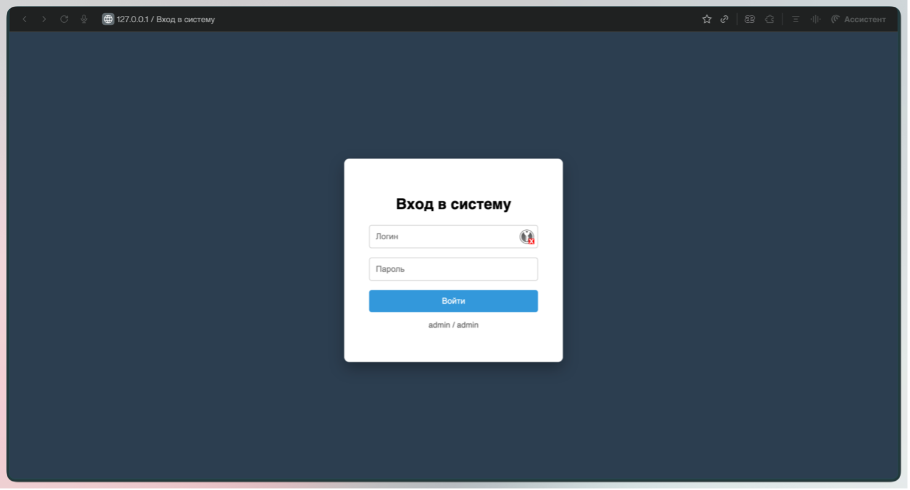
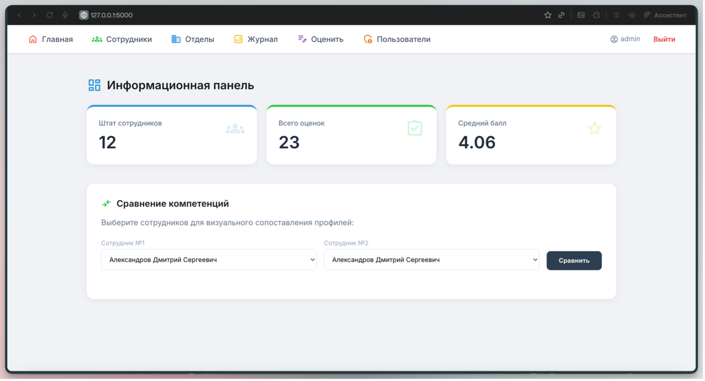
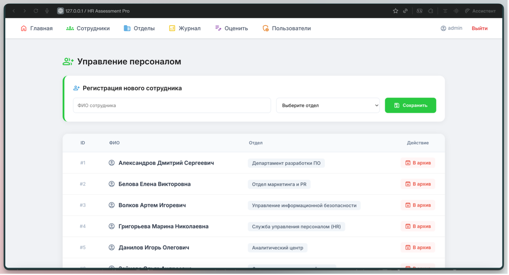
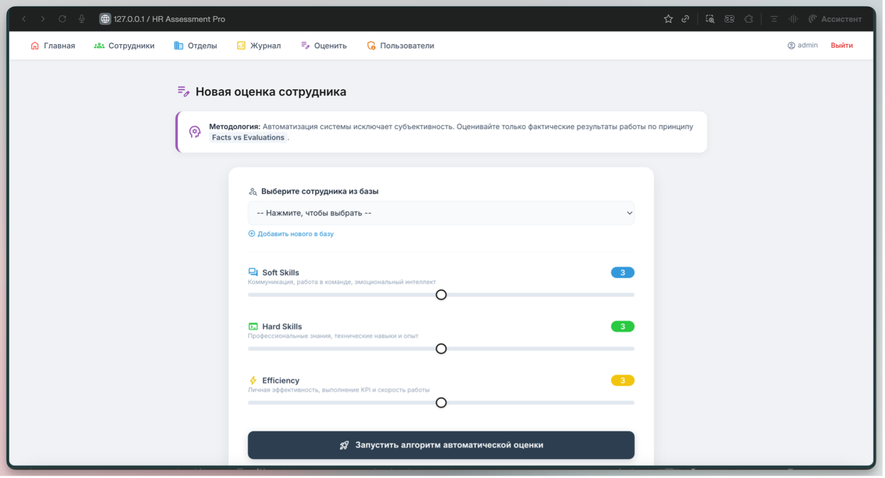
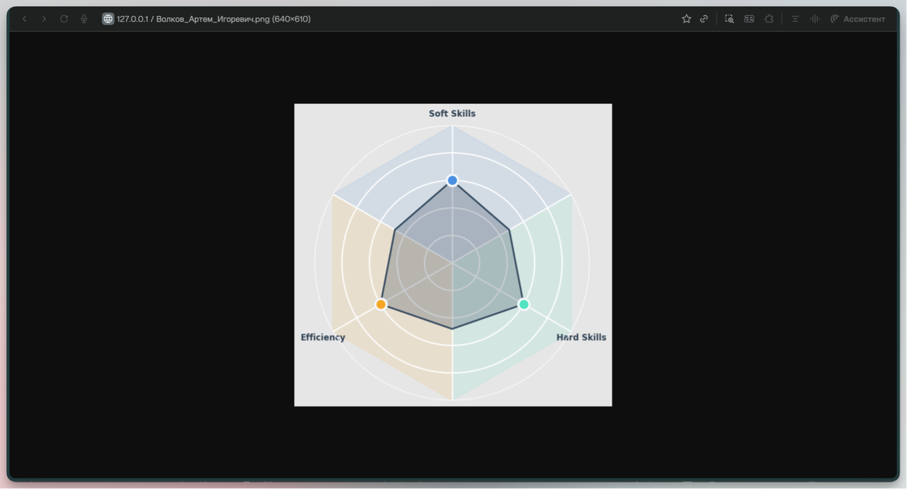
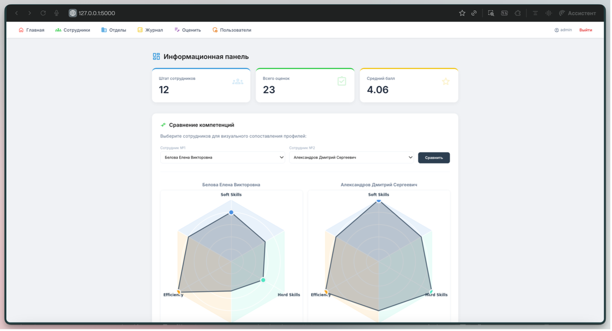

# 🧑‍💼 Employee Evaluation System

A Flask web application for employee evaluation, HR workflow automation, and personnel performance management.

---

# ✨ Features

- 👥 Employee management and archiving
- 🏢 Department management
- 📋 Personnel evaluation workflow
- 📊 Competency analysis and scoring
- 🔐 Role-based authentication
- 📄 PDF report generation
- 📈 Competency charts and analytics
- 🗄 SQLite database integration

---

# 🛠 Tech Stack

### Backend
- 🐍 Python
- 🌶 Flask
- 🧩 SQLAlchemy
- 🔐 Flask-Login

### Database
- 🗄 SQLite

### Frontend
- 🎨 HTML/CSS
- 🧱 Jinja2

### Analytics & Reports
- 📊 Matplotlib
- 🔢 NumPy
- 📄 ReportLab

---

# 📁 Project Structure

```text
employee-evaluation-system/
├── app.py                # Application entry point and routing
├── auth.py               # Authentication helpers
├── database.py           # Database layer and SQLite connection
├── models.py             # Evaluation logic and chart generation
├── requirements.txt      # Python dependencies
├── start.sh              # Startup script for macOS/Linux
├── arialmt.ttf           # Font used for PDF export
└── templates/
    ├── base.html
    ├── index.html
    ├── login.html
    ├── staff_list.html
    ├── departments_list.html
    ├── users_list.html
    ├── results_list.html
    └── assessment.html
```

---

# 📸 Screenshots

### 🔐 Login Page


### 🏠 Dashboard


### 👥 Employee Management


### 📋 Personnel Assessment


### 📊 Charts & Analytics



---

# 🚀 Usage

The system allows users to:

- 🔐 authenticate and manage user sessions
- 👥 manage employee records
- 📋 perform personnel evaluation
- 📊 analyze employee performance
- 📈 generate charts and analytical reports
- 🏢 manage departments and employee data
- 📄 export reports in PDF format

The application is intended for HR process automation and personnel assessment workflows.

---

# ⚙️ Installation

## 1️⃣ Clone the repository

```bash
git clone https://github.com/ronin1501/employee-evaluation-system.git
cd employee-evaluation-system
```

## 2️⃣ Create and activate a virtual environment

```bash
python3 -m venv venv
source venv/bin/activate
```

## 3️⃣ Install dependencies

```bash
python3 -m pip install -r requirements.txt
```

## 4️⃣ Run the application

Using Python:

```bash
python3 app.py
```

Or using the startup script on macOS/Linux:

```bash
./start.sh
```

The startup script creates `venv` and installs dependencies automatically on the first run.

---

# 🔑 Default Login

The database is created automatically on the first launch.  
A default administrator account is also created:

```text
Username: admin
Password: admin
```

---

# 🌐 Local Server

After running the application, it will be available at:

```text
http://127.0.0.1:5000/
```

---

# 💻 Environment

The project was developed and tested on:

- 🍎 macOS
- 🐍 Python 3.x
- 🌶 Flask

---

# 📌 Project Status

The project is completed as an educational full-stack web application and can be extended with additional HR analytics features.

---

# 👩‍💻 Author

Elena Schetchikova

🔗 GitHub: https://github.com/ronin1501
